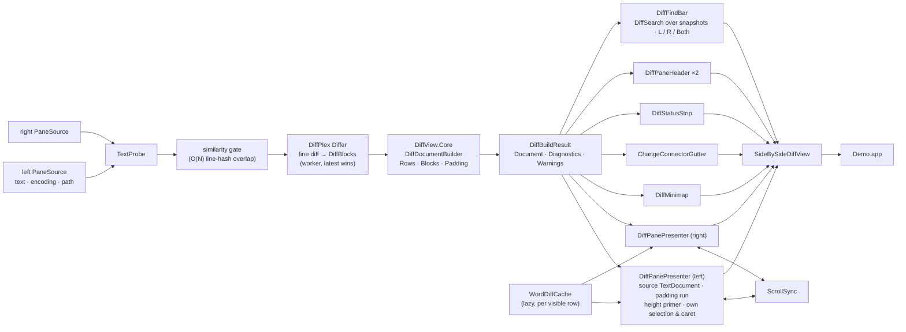

# 00001 — Side-by-side diff control on Avalonia 12 + AvaloniaEdit + DiffPlex

## Goal

A reusable, pure-C#, cross-platform Avalonia control library that renders a two-pane text diff
the way a real difftool does: row-aligned panes, synchronized scrolling, line-level and
word-level change highlighting, per-pane line-number gutters, change markers, change navigation,
an overview minimap, connectors between the panes, pane headers, a status strip, find across
either or both panes, syntax highlighting, and rendering that stays responsive on large files. A
small demo app loads two files and shows them.

A second, standalone deliverable falls out of the theme work: `theme-audit`, a dotnet tool that
finds the resource keys a theme leaves undefined — the invisible-control cases — and the tokens
that fall below a contrast floor, for any Avalonia project, not only this one.

Two properties are non-negotiable across every phase:

- **User feedback is a priority.** Every state the control can be in is visible in the control:
  what it is doing, what it found, where the user is, and what it could not do. Decorators —
  line numbers, markers, headers, status, tooltips, minimap, connectors — are in scope, not polish.
- **Robust error handling.** No failure is silent. Every boundary (input, diff build, grammar
  load, rendering, layout) is guarded, reported in the UI, and covered by a test that provokes it.

Read-only in this plan, but **editing-ready**: every design choice that in-pane editing will
depend on is made now and listed under *Editing readiness*, together with what the editing plan
will still have to add. Merging and folder compare are separate plans.

Repository root: `/home/janus/c/DiffView`.

First intended host: ClaudeForge (`/home/janus/c/cl/ClaudeForge`) — themed with Semi.Avalonia,
published trimmed, and carrying a Save Changes dialog whose old/new value rows want a real
side-by-side diff. Semi compatibility and trim safety are therefore requirements of this plan,
not options, and the conventions inherited from that repository are listed under *Conventions*.

## Non-goals

| Excluded | Note |
|---|---|
| 3-way merge / editable result pane | DiffPlex 1.9 ships 3-way merge APIs; a later plan builds on them |
| Folder / directory compare | Needs `TreeDataGrid`; separate plan |
| Binary, hex, image compare | Binary content is *detected and reported*, not diffed |
| In-pane editing | Panes are read-only in this plan; the design is editing-ready — see *Editing readiness* |
| Rule-based "unimportant differences" | Only `IgnoreWhitespace` / `IgnoreCase` in this plan |
| NuGet publication | Project is packable; publishing is not in scope |

## Terms

- **row** — an index into the alignment table, shared by both panes; padding rows exist on one side only.
- **line** — a pane's own line number, identical to its `TextDocument` line number.
- **block** — a maximal run of non-`Unchanged` rows.
- **padding** — rendered vertical space, never text, that keeps a line level with its counterpart.

## Stack

| Component | Version | Reason |
|---|---|---|
| Target framework | `net10.0` | SDK 10.0.400 is installed; Avalonia 12 and AvaloniaEdit 12 both target it |
| Avalonia | 12.1.2 | Current stable |
| Avalonia.AvaloniaEdit | 12.0.0 | Upstream NuGet package, requires Avalonia ≥ 12.0.0 |
| AvaloniaEdit.TextMate | 12.0.0 | Syntax highlighting; pulls TextMateSharp 2.0.3 + TextMateSharp.Grammars 2.0.3 |
| DiffPlex | 1.9.0 | Myers line diff (`Differ`, `DiffBlock`) and the word chunkers; the side-by-side builder is not used |
| Microsoft.Extensions.Logging.Abstractions | 10.x | The library's `ILogger` sink; no runtime dependency on a logging provider |
| Semi.Avalonia | 12.1.x | The demo's primary theme — what the intended host runs; the library never forces a theme. Source pinned under `reference/` at the tag matching the consumed package |
| Avalonia.Themes.Fluent, Avalonia.Fonts.Inter | 12.1.2 | The demo's secondary theme and chrome font |
| LayeredEditors.Avalonia.Diagnostics | local feed | ClaudeForge's Serilog pipeline, binding-error logger, crash dialogs and F12 log window, consumed by the demo |
| Serilog.Extensions.Logging | current | Bridges Serilog into the library's `ILogger` in the demo |
| System.CommandLine | 2.x | Command-line surface of the `theme-audit` tool |
| Bennewitz.Ninja.AutoVersioning | 2026.3.x | Build-time version generator, hoisted once in `Directory.Build.props` |
| Avalonia.Headless.XUnit | 12.1.2 | Headless UI tests on xunit v3 (`xunit.v3.extensibility.core`); Skia rendering enabled so frames can be captured |
| Verify.Xunit | current | Snapshot files; image comparison by a SkiaSharp tolerance comparer of our own (Skia is already loaded); DiffEngine opens a mismatch in Beyond Compare when it is installed |

Central package management (`Directory.Packages.props`) pins every version once. Package sources
are `nuget.org` and a local feed at `../nuget-local` — a `nuget-local` folder beside the
repository (`/home/janus/c/nuget-local` on this machine) — declared in `NuGet.config`. The
diagnostics package is produced from the ClaudeForge checkout with
`dotnet pack src/LayeredEditors.Avalonia.Diagnostics -c Release -o <feed>`; its version is pinned
in `Directory.Packages.props` and bumped deliberately.

### AvaloniaEdit: upstream package, no fork

SourceGit consumes a fork (`love-linger/AvaloniaEdit`) as a submodule. The fork is of
**AvaloniaEdit only**; Avalonia itself comes from NuGet in both SourceGit and the fork. Its
`patch-on-12.x` branch is a single commit on upstream master (`12.0.0-rc1-72-gbe976ea`,
2026-06-05), 9 files, +45/−46:

| Change | Relevance here |
|---|---|
| `BackgroundGeometryBuilder`: return no rects when `TextView.VisualLinesValid` is false | Relevant — prevents `VisualLinesInvalidException` from a background renderer during layout. Replicated by a guard in our own renderers; no fork needed |
| `NewLineFinder`: lone `\r` no longer terminates a line | Upstream behaviour is kept. DiffPlex's `LineChunker` splits on the same three terminators (`\r\n`, `\r`, `\n`), so line numbering agrees with no normalization; asserted by a test on the mixed-line-ending fixture |
| `TextView`: +16 px horizontal, +8 px vertical scroll slack | Cosmetic; our composite control sets its own padding |
| Package bumps (Avalonia 12.1.2, TextMateSharp 2.0.4), culture-explicit case conversion, an unused constant, a `Debug.Assert`, a `nameof` fix | Irrelevant |

Every integration point this plan needs is on public API: `TextView.GetOrConstructVisualLine`
for height priming, `TextArea.SelectionBrush` / `Caret.CaretBrush` for our own selection and
caret drawing, `SearchPanel.Uninstall()`, `TextDocument.CreateSnapshot()`, `VisualLineElementGenerator`.

Decision: reference `Avalonia.AvaloniaEdit` 12.0.0 from NuGet. If a fix on upstream master
that post-dates the 12.0.0 package turns out to be needed (the fork's base includes a
TextMate highlight race fix from 2026-06), the fallback is a submodule of **upstream**
`AvaloniaUI/AvaloniaEdit` at a pinned commit — still no Avalonia fork, still no third-party fork.

### Reference implementation

SourceGit (MIT) `src/Views/TextDiffView.axaml` + `.axaml.cs` — ~1400 lines on Avalonia 11.3.20.
It is a **design reference, not a dependency**: its input is a parsed git patch (hunks); ours is
a DiffPlex line diff; it pads with real lines, we render padding; it targets Avalonia 11, we
build on 12. What gets reused is the rendering approach: background renderer for line/word
highlights, custom margins, bound scroll offsets, minimap column, TextMate integration. Anything
copied close to verbatim is attributed in `THIRD-PARTY-NOTICES.md`.

ClaudeForge (`/home/janus/c/cl/ClaudeForge`) is the second reference: `StatusController`, the
status and kind tokens, the accessibility coverage guard and the diagnostics package are lifted
from it (MIT, attributed), and its conventions are adopted under *Conventions*.

### Reference sources

`reference/` at the repository root holds read-only checkouts of the upstream sources this project
is built against — for theme and control discovery, for reading a control's behaviour before a
feature is added to this project or to ClaudeForge, and for the tests that audit theme keys. The
checkouts are never committed: `.gitignore` excludes every directory under `reference/` and keeps
only `reference/README.md` and `reference/sources.json`.

`reference/sources.json` is the manifest — one entry per source with its directory, git URL,
pinned ref, and optional sparse paths; a `local` entry names a sibling checkout that is not fetched:

| Directory | Source | Pinned to | Sparse paths |
|---|---|---|---|
| `reference/Semi.Avalonia` | `irihitech/Semi.Avalonia` | `v12.1.0.1` — the tag matching the consumed package | — |
| `reference/Avalonia` | `AvaloniaUI/Avalonia` | the 12.1.2 release tag | `src/Avalonia.Themes.Fluent`, `src/Avalonia.Themes.Simple` |
| `reference/AvaloniaEdit` | `AvaloniaUI/AvaloniaEdit` | the 12.0.0 release tag; master recorded for the fork delta | — |
| `reference/DiffPlex` | `mmanela/diffplex` | the 1.9.0 release tag | — |
| `../cl/ClaudeForge` | local | — | — |

Pins track consumed package versions: bumping a package bumps its pin in the same commit.

`scripts/fetch-reference.sh` (`#!/usr/bin/env bash`, bash 3.2) and `scripts/fetch-reference.ps1`
(pwsh 7) read the manifest and clone what is missing — shallow, at the pinned ref, sparse where
asked — and report what is present and at which ref; `--update` re-fetches an entry whose pin
changed. `dotnet test` self-heals on a fresh clone: the test project's `EnsureReferenceSources`
MSBuild target runs the script before reference-dependent tests, and CI runs the same target. A
test that still cannot find a source fails with the fetch command in its message; it never
silently skips. Checkouts are read-only; a change an upstream needs is a pull request to that
upstream or a recorded local workaround, never an edit under `reference/`.

### Host themes and the theme-key audit

The library never forces a theme on its host. Semi.Avalonia is the first-class host — it is what
the intended consumer runs — Fluent is the second, and Simple is covered because it is cheap once
the audit exists.

Why an audit: a `DynamicResource` whose key the active theme does not define resolves to nothing,
and a control painted with nothing is invisible — no exception, no log line. ClaudeForge's own
`App*` tokens exist because Semi resolves the `SystemControl*` family inconsistently. Measured on
the reference checkouts: Fluent defines 1,199 keys (113 `SystemControl*` brushes, 29
`System*Color`s); Simple defines 292; Semi defines 624 per variant and **none** of the `System*`
family. AvaloniaEdit's `Themes/Fluent` needs `SystemAccentColor`, `SystemBaseLowColor` and
`SystemChromeMediumColor`; its `Themes/Simple` needs `ThemeBorderLowColor`, `ThemeBackgroundColor`
and `HighlightColor`. Under Semi every one of those is missing.

Semi ships six variants: `Light`, `Dark`, and four declared in `SemiTheme.axaml.cs` — `Desert`
(inherits Light), `Aquatic`, `Dusk`, `NightSky` (inherit Dark) — with their own overrides under
`Tokens/HighContrast`. A key that resolves under Dark also resolves under its inheritors through
the variant chain, but its *contrast* against an inheritor's surfaces is a separate question, so
every variant is a separate target: ten in all (Fluent 2, Simple 2, Semi 6).

The audit is a tool, not a one-off, and it is generic by construction: themes in, consumers in,
findings out. `src/ThemeAudit` is a standalone dotnet tool, `theme-audit`, with a library core
the tests call directly; it depends on nothing in DiffView, takes any theme source directory (a
checkout, or the AXAML extracted from a NuGet package) and any consumer directory as arguments,
and is packed to the local feed so any Avalonia project — ClaudeForge first — runs it as a local
tool. For this repository it reads the reference checkouts and produces `docs/theme-audit.md`:

1. **Inventory** — every `x:Key` each theme defines, per variant, plus every key DiffView's own
   templates define.
2. **Consumers** — every key referenced through `DynamicResource`, `StaticResource` or a
   `ThemeDictionaries` lookup by: DiffView's templates; AvaloniaEdit's Fluent and Simple themes;
   Fluent's own control templates (the set any Fluent-styled third-party control may reach for);
   and ClaudeForge's views and templates through the manifest's local entry, so the audit serves
   both projects.
3. **Findings** — per (consumer, theme, variant): keys referenced but undefined, which are the
   invisible-control cases; and keys defined on both sides whose colour lands below a contrast
   floor against that variant's own page and control surfaces.

The audit drives three deliverables, each exhaustive over the inventory rather than over what the
two applications happen to use today:

- **`DiffView.*` tokens** defined for all ten targets — Light and Dark dictionaries with
  per-Semi-variant overrides wherever the contrast test demands one — with a contrast test per
  variant computed against that variant's own surface colours from the inventory, not against an
  assumed white and near-black.
- **`Themes/Compat/FluentKeys.Semi.axaml`** and a Simple sibling — generated resource
  dictionaries that define, per Semi variant, every Fluent-family key absent under Semi (the
  113 `SystemControl*` brushes, the 29 `System*Color`s, and the rest of the 1,199 a control
  template may reference), mapped onto Semi's own tokens by a reviewed table shipped with the
  tool (`src/ThemeAudit/Mappings/FluentToSemi.json`, overridable per run). AvaloniaEdit's search
  panel, or any Fluent-coupled control a
  host drops beside the diff, stops going invisible. Generated, never hand-edited; regenerated
  whenever a pin moves, and a drift test keeps the committed output equal to a fresh run.
- **A resolution test** — under every target, every key referenced by DiffView's templates and by
  AvaloniaEdit's themes resolves through `TryGetResource`, and rendering the composite produces no
  resource or binding warning through the logger bridge.

`DiffPanePresenter` still ships its own style bound only to `DiffView.*` tokens: the compat
dictionary is a safety net for what surrounds the control, not a substitute for owning the
control's own brushes. Consumers include the compat dictionary when they host Fluent-coupled
controls under Semi; ClaudeForge is the first candidate, and the dictionary is contributed there.

## Architecture



### Projects

```
/home/janus/c/DiffView
  DiffView.slnx
  global.json                      SDK 10.0.x, rollForward latestFeature
  NuGet.config                     nuget.org + the local feed at ../nuget-local
  Directory.Build.props            net10.0, Nullable, ImplicitUsings, LangVersion preview, TreatWarningsAsErrors, PDB policy, AutoVersioning
  Directory.Packages.props         central package versions
  tests/Directory.Build.props      imports the root file; shared test packages
  .github/workflows/ci.yml         three-OS build-and-test matrix + trim-check job
  src/DiffView.Core/               no Avalonia dependency; diff, alignment, probing, search, diagnostics
  src/DiffView.Avalonia/           the controls; Themes/ holds the templates, the palettes and the generated Compat/ dictionaries
  src/DiffView.Demo/               desktop demo: Semi primary + Fluent switch; LayeredEditors.Avalonia.Diagnostics; open two files, toggles
  src/ThemeAudit/                  standalone dotnet tool `theme-audit` (package Bennewitz.Ninja.ThemeAudit): inventory, consumers, findings, contrast, compat generator; no DiffView dependency
  tests/DiffView.Core.Tests/       xunit v3: unit tier
  tests/DiffView.Avalonia.Tests/   Avalonia.Headless.XUnit + Skia: headless UI tier; Snapshots/ holds the rendered-snapshot tier
  tests/ThemeAudit.Tests/          xunit v3: unit tier for the tool, on small fixture theme files
  reference/                       read-only upstream checkouts, gitignored; README.md and sources.json committed
  scripts/fetch-reference.sh       fetch the manifest's sources on demand (bash 3.2); .ps1 sibling for pwsh 7
  docs/theme-audit.md              the audit report, regenerated on every pin bump
  fixtures/                        small / 10k-line / 200k-line pairs; unrelated pair; binary; mixed line endings; 1 MB single line; bundled monospace font
  plans/
  AGENTS.md                        from Phase 4: fact-shaped cross-file contracts
  CHANGELOG.md
  PROGRESS.md
  DECISIONS.md
  THIRD-PARTY-NOTICES.md
```

Root namespace `Bennewitz.Ninja.DiffView`; assembly names are unprefixed (`DiffView.Core`,
`DiffView.Avalonia`, `DiffView.Demo`).

### `DiffView.Core`

Input and probing:

- `DiffSide { Left, Right }` — used wherever a side is named; nothing in the API is called "old" or "new"
- `PaneSource { Text, Encoding?, Path?, Title? }` — implicit conversion from `string`;
  `PaneSource.FromBytes(bytes, path)` decodes by BOM then UTF-8 validation with Latin-1 fallback,
  detects binary on the bytes, and records the encoding; `FromFile(path)` wraps it
- `TextProbe.Probe(string) → TextInfo { LineEnding: Lf | CrLf | Cr | Mixed, LineCount, Length, NulCount }`;
  `TextInfo.Encoding` and `IsBinary` come from the loader
- `DiffOptions { IgnoreWhitespace, IgnoreCase, WordDiff: Word | Character | Off, WordSeparators, MaxWordDiffLineLength, AlignmentSimilarityFloor }`
  — `WordSeparators` defaults to DiffPlex's set (space, tab, `.(){},!?;`) extended with `= + - * / " ' [ ] < > : &|`

Build:

- `DiffDocumentBuilder.Build(left: PaneSource, right: PaneSource, options, CancellationToken) → DiffBuildResult`
  — stages: probe → similarity gate → `Differ.CreateDiffs(…, LineChunker)` → rows from `DiffBlocks` → blocks.
  Cancellation is honoured **between stages**; the Myers run itself is not interruptible (DiffPlex has no token)
- `DiffBuildResult { Document: SideBySideDocument, Diagnostics: DiffDiagnostics, Warnings: IReadOnlyList<DiffWarning> }`
- `DiffDiagnostics { BuildTime, RowCount, BlockCount, Inserted, Deleted, Modified, Similarity, Aligned, LeftInfo, RightInfo }`
- `DiffWarning { Code, Message }` — `MixedLineEndings`, `TooDifferentToAlign`, `LongLinesSkipped`, `Latin1Fallback`
- `SideBySideDocument { Left: DiffPane, Right: DiffPane, Rows: AlignedRow[], Blocks: IReadOnlyList<ChangeBlock>, Version }`
- `DiffPane { Lines: DiffLine[], Info: TextInfo }` — index = **line**; the pane's text is not stored here, the editor's document owns it
- `DiffLine { Kind: Unchanged | Inserted | Deleted | Modified, Row }`
- `AlignedRow { LeftLine: int?, RightLine: int?, Kind }` — a `null` side is a padding row on that side
- `ChangeBlock { Index, Kind, FirstRow, LastRow, LeftLines: LineRange?, RightLines: LineRange?, InsertedCount, DeletedCount, ModifiedCount }` — either range may be empty
- `Padding.Before(document, side, line)`, `Padding.Trailing(document, side)` — derived from `Rows`, cached per build
- Pairing inside a block: the first `min(deleted, inserted)` lines pair as `Modified`; the remainder are `Deleted` or `Inserted` with padding opposite

Word level, computed lazily:

- `WordDiffCache.GetPieces(row, leftLineText, rightLineText) → (left: PieceRange[], right: PieceRange[])`
  — runs `Differ.CreateDiffs` with the word or character chunker for one `Modified` row on first
  request, microseconds per row, LRU-cached and keyed by `(Version, row)`; lines longer than
  `MaxWordDiffLineLength` return empty pieces and are counted in `LongLinesSkipped`
- `PieceRange { Start, Length, Kind }` — char offsets inside the line

Search:

- `IPaneText { LineCount, GetLine(int) }` — how search reads a side; `StringPaneText` for Core and tests
- `FindOptions { MatchCase, WholeWord, UseRegex, Scope: DiffSide | Both, ChangedRowsOnly, MaxMatches }`
- `DiffSearch.Find(document, left: IPaneText, right: IPaneText, query, options, CancellationToken) → FindResult`
  — regex uses `RegexOptions.NonBacktracking` when the pattern allows it, otherwise backtracking with a match timeout
- `FindResult { Matches: IReadOnlyList<FindMatch>, LeftCount, RightCount, Truncated, Error: string? }`
- `FindMatch { Side: DiffSide, Line, Column, Length }` — ordered by row, then side (left first), then column

The model is **source-indexed**: line metadata is keyed by real line numbers on each side, and
alignment is a separate table. Padding is derived, never materialized as text. This is what keeps
the editor's document equal to the source text — the property in-pane editing depends on (see
*Editing readiness*). No line-ending normalization is applied anywhere: DiffPlex's `LineChunker`
and AvaloniaEdit's `NewLineFinder` recognise the same three terminators, and a test guards that
their line counts agree.

Failure contract: `Build` throws `DiffBuildException` (with the inner cause) for genuine
failures, throws `OperationCanceledException` on cancellation between stages, and never throws
for degraded outcomes — those are `Warnings`. Binary input is a `DiffBuildException` with code
`BinaryInput`. `DiffSearch.Find` never throws for a bad query: an invalid regular expression, or
one that hits the match timeout, comes back as `FindResult.Error`; an empty query is an empty result.

Invariants, each backed by a test:

1. every line of each side appears exactly once in `Rows`, in order
2. no row has both sides `null`
3. for a `Modified` row, the left pieces concatenate to the left line and the right pieces to the
   right line, so piece offsets are trustworthy
4. `Blocks` are disjoint, ordered, and cover every non-`Unchanged` row; each block's per-side
   line ranges are exactly the non-`null` lines of its rows
5. `Cr`, `CrLf` and `Lf` variants of the same content produce identical `Rows`
6. per side, `Padding.Before` summed over all lines plus `Padding.Trailing` equals that side's
   `null` row count
7. below `AlignmentSimilarityFloor` on inputs above the size threshold, `Aligned` is false, `Rows`
   is the unaligned concatenation (all left lines `Deleted`, then all right lines `Inserted`), and
   `TooDifferentToAlign` is present

### `DiffView.Avalonia`

| Type | Base | Responsibility |
|---|---|---|
| `DiffPanePresenter` | `TextEditor` | Hosts the pane's **source** `TextDocument` — never a padded copy. Calls `SearchPanel.Uninstall()`. `IsReadOnly` per side, default true, honoured rather than assumed; `WordWrap` forced off; horizontal scrollbar visibility forced equal on both panes; the left pane's vertical scrollbar hidden. Holds the pane's `DiffLine[]` and padding table, **bounds-checked and version-stamped**: a line the metadata does not know renders as `Unchanged`. A rebuild swaps the metadata, re-primes, and redraws; it never replaces the document. Ships its own style bound only to `DiffView.*` tokens (see *Host themes*) |
| `PaddingElement` / `PaddingRun` | `VisualLineElement` / `DrawableTextRun` | A zero-length element whose run has `Size = (0, k · lineHeight)` and a `Baseline` chosen per direction: bottom-aligned to put padding *above* a line, top-aligned for trailing padding after the last line. No controls, no arrange pass |
| `PaddingElementGenerator` | `VisualLineElementGenerator` | Emits a `PaddingElement` at the start of each line with `Padding.Before > 0` and at the end of the last line for `Padding.Trailing`. Returns nothing on any exception (misaligned but alive) and raises `RenderFault` |
| `PaddingHeightPrimer` | plain class | After every rebuild, and again when `Document` or `DefaultLineHeight` changes, calls `TextView.GetOrConstructVisualLine` for every line whose padding changed, so the `HeightTree` knows the padded heights **before** those lines scroll into view. Cost bounded by the number of padding gaps |
| `DiffLineBackgroundRenderer` | `IBackgroundRenderer` (`KnownLayer.Background`) | Full-row fill by `Kind` using `TextTop` / `TextBottom`; hatched over padding space; word-level rectangles from `WordDiffCache` via `BackgroundGeometryBuilder`; current-block border. `Draw` returns early when `VisualLinesValid` is false and catches everything else into `RenderFault` |
| `DiffSelectionRenderer` | `IBackgroundRenderer` (`KnownLayer.Selection`) | Draws the selection from `TextArea.Selection.Segments` with text extents; AvaloniaEdit's own `SelectionBrush` / `SelectionBorder` are transparent so the selection never paints padding |
| `DiffCaretRenderer` | `IBackgroundRenderer` (`KnownLayer.Caret`) | Draws the caret from `Caret.Position` with text extents and the editor's blink cadence; `Caret.CaretBrush` is transparent so the caret is never padded-line tall |
| `DiffLineNumberMargin` | `AbstractMargin` | Draws the document's own line numbers — no lookup — and nothing over padding space; tooltip with the aligned line on the other side |
| `ChangeMarkerMargin` | `AbstractMargin` | 1-char strip: `+` / `-` / `~`; tooltip with the block summary ("3 lines inserted") and, on a long line, "word-level skipped" |
| `ScrollSync` | plain class | Two-way vertical offset coupling; re-entrancy guard; optional horizontal coupling |
| `DiffMinimap` | `Control` | Whole-document overview: one stripe per pixel bucket, the bucket's kind being the strongest change in it; viewport rectangle; click maps pixel → bucket → first changed row; hover tooltip; tick marks for find matches |
| `ChangeConnectorGutter` | `Control` | Owns the column between the panes. Draws a filled polygon per visible block joining its left and right extents; the current block outlined. Click on a polygon makes that block the current change; drag on empty space resizes the panes. This surface later hosts the copy-to-side arrows |
| `SearchMatchRenderer` | `IBackgroundRenderer` (`KnownLayer.Selection`) | Per pane: highlights every match in that pane; the current match in a distinct brush. Above the diff row fills, below the text |
| `DiffFindBar` | `TemplatedControl` | Query box; Match case · Whole word · Regex · Changed rows only toggles; scope segmented control **L / R / Both**; "match i of n (L a · R b)"; next / previous / close; inline error line for a bad pattern |
| `DiffPaneHeader` | `TemplatedControl` | Per pane: title or path, line count, encoding, line-ending style, size; "binary", "empty" or "identical" badge |
| `DiffStatusStrip` | `TemplatedControl` | State (Building with progress · Ready · Degraded · Failed), `+n −m ~k`, "change i of n", find count and scope while the find bar is open, line:col of the focused pane, options in effect, build time; error banner with message and Retry; a transient pill driven by `StatusController` — success clears itself, warning lingers, failure sticks with × |
| `SideBySideDiffView` | `TemplatedControl` | Composite: `[header | header]` / `[find bar]` / `[left | connector gutter | right | minimap]` / `[status strip]`; public API below |

Supporting types: `DiffBrushes` resolves `DiffView.*` tokens to `IBrush` for the renderers with
hard fallbacks and re-resolves on `ActualThemeVariantChanged`; `DiffViewStrings` puts every
user-visible string behind a swappable `Resolver`, English by default, with `ResetForTesting()`;
`StatusController` is lifted from ClaudeForge — `Active` sticks, `Success` clears after 6 s,
`Warning` after 10 s, `Failure` sticks until dismissed, `State` is quiet identity text — and runs
on a `TimeProvider`.

Public surface of `SideBySideDiffView`:

- `LeftSource`, `RightSource` (`PaneSource`; assigning replaces that side's document)
- `LeftDocument`, `RightDocument` — the live AvaloniaEdit `TextDocument`s; `LeftReadOnly`, `RightReadOnly` (default `true`)
- Styled option properties `IgnoreWhitespace`, `IgnoreCase`, `WordDiff`, `MaxWordDiffLineLength`
  that compose into `DiffOptions`; `UseSyntaxHighlighting`, `FileName` (grammar selection by extension)
- `ShowWhitespace`, `ShowLineEndings`, `TabWidth`, `SyncHorizontalScroll`
- `State` (`Empty | Building | Ready | Degraded | Failed`), `StateMessage`, `Diagnostics`, `Warnings`
- `CurrentChangeIndex`, `ChangeCount`; commands `NextChange`, `PreviousChange`, `FirstChange`, `LastChange`, `Retry`
- `IsFindBarOpen`, `FindQuery`, `FindOptions` (scope L / R / Both and the toggles), `FindResult`,
  `CurrentFindMatchIndex`; commands `OpenFind`, `CloseFind`, `FindNext`, `FindPrevious`
- Events `BuildCompleted`, `BuildFailed`, `RenderFault`, `FindCompleted`
- `Logger` (`ILogger?`) — every state transition, warning and fault is logged when set
- Default key bindings, all overridable: F7 / Shift+F7 next / previous change; F6 switches the
  focused pane; Ctrl+F opens the find bar with the query pre-filled from the current selection;
  Enter / F3 next match, Shift+Enter / Shift+F3 previous match; Esc closes the find bar and
  returns focus to the pane that had it
- Theme resources with light/dark variants: `DiffView.InsertedBrush`, `DeletedBrush`,
  `ModifiedBrush`, `PaddingBrush`, `WordInsertedBrush`, `WordDeletedBrush`,
  `CurrentBlockBorderBrush`, `ConnectorBrush`, `FindMatchBrush`, `FindCurrentMatchBrush`,
  `SelectionBrush`, `CaretBrush`, and the status family
  `Status{Success,Warning,Failure,Active}{Foreground,Background}Brush` with ClaudeForge's measured
  values. Marker and kind colours are ClaudeForge's Save Changes pills — inserted `#2E7D32`,
  deleted `#C62828`, modified `#F57C00` — so DiffView reads as native inside it. Two dictionaries
  ship: the default palette and a colour-blind-safe palette; both are distinguishable without hue
  because the marker margin carries `+ - ~`
- `TimeProvider` (default `TimeProvider.System`) behind every debounce and auto-clear; every
  user-visible string behind `DiffViewStrings.Resolver`

Find semantics: a match belongs to one pane. In `Both` scope, next/previous walk the matches in
row order, left before right within a row, so the walk never jumps backwards on screen. Moving to
a match scrolls both panes (rows are aligned), selects the match in its pane, and gives that pane
keyboard focus so the user can see which side the hit is on.

Scroll sync: after priming, both panes have the same number of rows at the same line height with
no wrapping and the same scrollbar visibility, so their scroll extents are equal and vertical sync
is a 1:1 offset copy. Priming is what makes that true — without it the `HeightTree` only learns a
padded line's height when the line is rendered.

## Error handling and feedback

These rules apply to every phase; each phase's *done when* lists the tests that enforce them.

**States.** The control is always in exactly one of `Empty`, `Building`, `Ready`, `Degraded`,
`Failed`. The status strip renders the state; `Degraded` and `Failed` carry a message a user can
act on ("Files are too different to align — shown unaligned", "Left side is binary — text diff is
not available", "Word-level highlighting skipped on 3 lines longer than 20,000 characters"). The
previous result stays on screen, marked stale in the status strip, while a new build runs.

**Boundaries.** Each boundary catches, reports, and keeps the rest of the control working:

| Boundary | On failure |
|---|---|
| Input (`PaneSource`, `TextProbe`) | Binary → `Failed` with `BinaryInput`; undecodable bytes → Latin-1 plus `Latin1Fallback` warning; mixed or `Cr` line endings → `MixedLineEndings` warning; null source → `Empty` with "No content" in that pane's header |
| Similarity gate | Below the floor on large inputs → `Degraded`, sides shown unaligned, `TooDifferentToAlign` in the status strip; the user can force alignment from the banner |
| Diff build | `DiffBuildException` → `Failed`, error banner with message and Retry; a superseded build is discarded silently |
| Grammar / theme install | Any exception → plain text plus `Degraded` with the grammar name in the message; never affects diff highlighting |
| Find | Invalid regular expression or a match timeout → inline error in the find bar, no highlights, control state unchanged; more than `MaxMatches` hits → highlights and navigation over the first `MaxMatches` plus a truncation notice in the find bar |
| Layout (`PaddingElementGenerator`, margins' measure) | Exception caught, `RenderFault` raised once, the generator yields no padding for that line (misaligned but alive), state `Degraded` |
| Rendering (`Draw` in every renderer, minimap, connectors) | Exception caught, `RenderFault` raised once per fault, state `Degraded`, plain text remains visible; the faulting decorator disables itself rather than throwing on every frame |
| Demo file loading | IO and decoding errors shown in the pane header and status strip, with the path |

**Threads.** Workers never touch a `TextDocument` — it enforces owner-thread access. The build
worker receives text captured on the UI thread; the search worker reads `TextDocument.CreateSnapshot()`
through `IPaneText` with line offsets captured on the UI thread. Word-level pieces are computed on
the UI thread on demand from the visible rows.

**Responsiveness.** One build worker, latest wins, at most one request pending; a new input
supersedes the pending one. The status strip shows progress after 100 ms. Cancellation is honoured
between build stages; the Myers run itself is not interruptible, which is why the similarity gate
runs first. Nothing on the UI thread blocks for longer than one frame on the 10k-line fixture. Find
runs incrementally as the query or options change, debounced, off the UI thread above the row
threshold, and every change cancels the search in flight; regular expressions are non-backtracking
where possible and carry a match timeout otherwise.

**Diagnostics.** `DiffDiagnostics` is always populated on `Ready`/`Degraded` and shown in the
status strip (build time, counts, similarity). With a `Logger` set, every state transition, warning
and fault is logged at the appropriate level with the same message the UI shows.

**Transient messages.** Outcomes that are not the build state — identical files, a grammar that
fell back, a find that hit its cap — go through `StatusController`'s typed `SetStatusXxx`
helpers so severity is classified at the call site: `Success` clears itself, `Warning` lingers,
`Failure` sticks until dismissed. No caller writes status text directly.

**XAML layer.** Avalonia's own logger is bridged into the host's log in the demo and into a test
sink in the tests; a binding or resource-resolution warning is a test failure, not a console line.

**Logging — the library.** The library logs through `ILogger` only; it never writes a file,
never shows a dialog, never touches the console. Categories are `DiffView.Build`,
`DiffView.Render`, `DiffView.Find` and `DiffView.Theme`; every state transition is `Information`,
every warning `Warning`, every fault `Error` with the exception attached, cancellation `Debug`.
**Document text is never logged** — not a line, not a match, not a piece: log lines carry counts,
line numbers, lengths, paths and timings only, because the content being compared may be a
secret. A test loads a fixture containing a sentinel string, exercises build, render, find and a
forced fault, and asserts the sentinel never reaches the captured log.

**Logging and crash handling — the demo.** The demo adopts ClaudeForge's pipeline wholesale
through `LayeredEditors.Avalonia.Diagnostics`. `ConfigureLogging` runs before
`BuildAvaloniaApp`: a bucketed rolling file sink (8-hour buckets, 3-day retention) in a per-user
OS-conventional logs directory, `Serilog.Sinks.Trace` for the debugger, the F12 live-log window,
and Avalonia's internal logger bridged with `Layout` / `Property` / `Visual` muted below
`Warning`. `InstallAvaloniaHooks` runs after framework init for the binding-validation error
logger. The log directory is printed to stderr and logged once at startup; `Starting` / `Exiting`
bracket lines mark a clean session; `XDG_SESSION_TYPE` is logged on Linux. Crash handling is the
three-handler set from ClaudeForge's `App.axaml.cs`: `Dispatcher.UIThread.UnhandledException`
marks the event handled and shows `FatalErrorDialog` (resizable, copy-to-clipboard);
`TaskScheduler.UnobservedTaskException` observes the exception, logs all-cancellation aggregates
at `Verbose` and benign Linux DBus/portal failures at `Debug`, and marshals the dialog to the UI
thread; `AppDomain.UnhandledException` logs `Fatal` and falls back to the native OS dialog
because Avalonia may already be dead. The bootstrap `try` around
`StartWithClassicDesktopLifetime` shows both dialogs in turn, and `Log.CloseAndFlush()` runs in
`finally`. Debug flags on the demo's command line — `--theme`, `--variant`, `--left`, `--right`,
`--log-level` — are parsed before logging is configured and summarised once after, in
ClaudeForge's two-phase order.

**Tests provoke every failure path.** Binary input, an unrelated pair, a builder that throws, a
superseded build, a grammar that fails to load, a renderer that throws, a generator that throws, a
file that does not exist, a file in an undecodable encoding — each has a headless or unit test
asserting the state, the message, and that the rest of the control still functions.

## Feedback surface

Every decorator, what it tells the user, and the phase that delivers it.

| Decorator | Tells the user | Phase |
|---|---|---|
| Every surface visible under every host theme variant | Nothing disappears when the host switches theme | 2 |
| Row backgrounds by kind; hatched padding | What changed, and where a side has no counterpart | 4 |
| Line numbers per pane, nothing over padding | Where they are in each file | 4 |
| Change marker margin `+` `-` `~` | Kind of change at a glance, scannable down the gutter | 4 |
| Text-height selection and caret | The selection and caret never swallow padding | 4 |
| Pane headers | Which file, how big, which encoding and line endings; binary/empty/identical badge | 5 |
| Status strip: state, progress, counts, options | What the control is doing and what it found | 5 |
| Error banner with Retry; "too different to align" banner with Force | What failed or was skipped, and how to override | 5 |
| "Files are identical" | That an empty diff is a result, not a failure | 5 |
| Caret line:col in status strip | Where the caret is | 5 |
| Transient status pill — success / warning / failure with lifecycle, × to dismiss a failure | The outcome of the last operation, with a severity you can see without reading | 5 |
| Word-level highlights | Which characters changed within a line | 6 |
| "Word-level skipped" on a long line's tooltip | Why a long line has no word highlights | 6 |
| Current-block border in both panes; "change i of n" | Which change is selected and how many remain | 7 |
| Minimap with viewport rectangle | Where the viewport is in the whole file, where the changes cluster | 7 |
| Connector gutter; click selects the block | How left and right blocks correspond, and a direct way to pick one | 7 |
| Tooltips on line numbers, markers, minimap | Aligned line on the other side, block summary, row under the cursor | 7 |
| Find bar: scope L / R / Both, option toggles, "match i of n (L a · R b)" | What is being searched, where, and how many hits on each side | 8 |
| Match highlights; current match distinct, selected, and its pane focused | Where the hits are and which one is active | 8 |
| Minimap match ticks | Where the hits cluster in the whole file | 8 |
| Inline pattern error and truncation notice in the find bar | Why there are no results, or not all of them | 8 |
| Syntax colouring under the diff backgrounds | Structure of the code being compared | 9 |
| Whitespace and line-ending glyphs; mixed-line-ending notice | Invisible differences made visible | 10 |
| Focus visuals and automation names | Keyboard and screen-reader users can tell where they are | 10 |

## Editing readiness

In-pane editing is a later plan. The rule for this one: **editing must be a flip, not a
rewrite.** Every design choice editing depends on is made now, because each is cheap now and
expensive after the fact.

### Baked into this plan

| Choice | Why editing needs it | Cost now |
|---|---|---|
| The editor's document is the source text; padding is rendered by `PaddingRun`, never inserted as lines | Typing must edit the real file. A padded copy would need an offset-mapping projection layer, its own undo stack, and a document reload on every re-diff that destroys caret, selection and scroll | The Phase 1 spike; a generator, a primer, and our own selection and caret drawing |
| Source-indexed model with a separate alignment table (`DiffPane.Lines` by line, `Rows`) | After an edit only the metadata changes; the document stays. Copy-to-side is a `Replace` over the per-side line range that `ChangeBlock` already carries | Slightly more bookkeeping in Core |
| A rebuild never replaces a `TextDocument`; it swaps metadata, re-primes and redraws | Preserves caret, selection, scroll and AvaloniaEdit's own `UndoStack` — undo/redo per side comes for free | A rule, and a test in Phase 5 |
| Metadata lookups are bounds-checked and version-stamped; an unknown line renders as `Unchanged`, never throws | Between a keystroke and the re-diff, line numbers no longer match the metadata | A rule, and a test in Phase 4; it also protects the read-only control against renderer/document races |
| `IsReadOnly` per side is a property that presenters, renderers, margins and sync honour, never an assumption they rely on | Flipping it must not expose a hidden dependency | Review discipline; a test that the presenter honours the property |
| `PaneSource` carries the encoding; `TextInfo` carries the line endings | Save must write back what was read: same encoding, same line endings | A small record with an implicit conversion from `string` |
| `LeftDocument` / `RightDocument` exposed; `DiffSide` naming throughout, no "old" / "new" | An editable pane is neither old nor new; the host needs the live documents to save them | Naming |
| `ChangeConnectorGutter` owns its column with per-block hit-testing | The copy-to-side arrows live there | Click-to-select the block, which is a feedback feature anyway |
| Diff build is a latest-wins worker with the previous result held until the new one lands; priming re-runs after every rebuild | Live re-diff while typing is the same pipeline on a debounce | Already required for responsiveness |

### What the editing plan will add

Sized against this design; none of it reworks the pieces above.

1. **Enable typing** — set a side's `IsReadOnly` to false; the presenter already honours it.  (S)
2. **Live re-diff** — on `TextChanged`, debounce, rebuild through the existing pipeline, swap
   metadata, re-prime, redraw. During the debounce window the panes may be briefly misaligned;
   the padding catches up when the build lands.  (M)
3. **Dirty state and save** — `IsDirty(side)`, `Save(side)` writing with the encoding from
   `PaneSource` and the line endings from `TextInfo`; a file changed on disk since load is reported
   through the existing error boundary; dirty marker in the pane header and status strip.  (M)
4. **Copy to side** — arrows in the connector gutter per block and per line: `Replace` on the
   target side's line range with the source side's lines; the re-diff then collapses the block.
   Undo is the editor's own.  (M)
5. **Editing feedback** — modified-since-load marks in the marker margin, unsaved-changes state,
   key bindings for copy-left and copy-right.  (S)
6. **Tests** — headless typing re-diffs; undo restores; copy-to-side followed by re-diff yields no
   block; save round-trips CRLF and BOM byte-for-byte; snapshot of the dirty state.  (M)

### Deliberately not pre-built

No edit UI, no dirty tracking, no save path and no copy arrows ship in this plan. What ships is
the shape that makes each of those an addition rather than a rework.

## Contributing back to ClaudeForge

Both repositories have the same author. Anything this project improves that originated in, or
belongs in, ClaudeForge goes back there in the same working session, as its own Conventional
Commit on a branch with a pull request — ClaudeForge has the CI to prove it.

Qualifies: fixes and enhancements to the diagnostics package (`StatusController` on a
`TimeProvider`, the binding-error logger, the crash dialogs); the accessibility coverage guard made
generic; the report and compat dictionaries `theme-audit` generates for ClaudeForge — the tool
itself stays here and reaches ClaudeForge through the local feed as a dotnet tool — and the
`docs/UI-STYLE-GUIDE.md` §2 update they imply; new entries for `docs/AVALONIA-GOTCHAS.md` found
while building the control; and the control itself once it is ready to host the Save Changes
dialog's old/new rows.

Mechanics: the change lands in ClaudeForge first; where a package is affected it is repacked into
the local feed and the pin bumped here in the same change; `PROGRESS.md` keeps an "Upstreamed to
ClaudeForge" list with the commit or pull-request reference; a change ClaudeForge declines is
recorded in `DECISIONS.md` with the reason and kept local.

## Testing strategy

Three tiers. Every phase adds to each tier it touches, and a manual check never stands in for an
assertion that can be automated.

| Tier | Project | Harness | Covers |
|---|---|---|---|
| Unit | `tests/DiffView.Core.Tests`, `tests/ThemeAudit.Tests` | xunit v3 | Model invariants, probing, diagnostics and warnings, search, word-diff cache, every Core failure path; the audit tool's parser, scanner, contrast maths and generator |
| Headless UI | `tests/DiffView.Avalonia.Tests` | Avalonia.Headless.XUnit with Skia rendering | Control construction and templates, property and state changes, keyboard and pointer input through the headless window, focus movement, scroll sync and extents, renderer participation, every fault boundary |
| Rendered snapshots | same project, `Snapshots/` | `TopLevel.CaptureRenderedFrame()` → PNG, compared by Verify with a SkiaSharp tolerance comparer | Row and word highlights, both theme variants, decorators, find highlights, syntax colouring under the diff |

**Headless with real pixels.** The test app builder uses
`UseHeadless(new AvaloniaHeadlessPlatformOptions { UseHeadlessDrawing = false })` and `UseSkia()`,
so `CaptureRenderedFrame()` returns actual pixels. Pixel assertions read the bitmap at known
line and column positions ("line 3's text band is the inserted brush"); snapshot tests compare
the whole frame against a committed baseline.

**Pixel assertions gate; snapshots are few.** One coarse snapshot per phase on the small fixture in
each theme variant. Snapshots catch what assertions do not; they are not the primary check, so they
are not re-approved on every visual tweak.

**Deterministic frames.** Fixed window size, fixed font size, and a bundled permissively
licensed monospace font loaded as an embedded font for the panes and the UI chrome, so snapshots
do not depend on the machine's installed fonts. The comparison tolerance absorbs anti-aliasing
differences between platforms; per-OS baselines are introduced only if the tolerance proves
insufficient, and that is recorded in `DECISIONS.md`.

**Mismatches are reviewed, not overwritten.** Verify writes a `.received.png` next to the
`.verified.png`; DiffEngine opens the pair in Beyond Compare when it is installed. Approving a
change is a deliberate commit of the new baseline.

**Interaction.** Headless input (`KeyPress`, `KeyTextInput`, `MouseDown` / `MouseMove` /
`MouseUp`, `MouseWheel`) drives the composite control the way a user would: open the find bar
with Ctrl+F, type a query, press F3, drag the gutter, click the minimap.

**Performance is measured, not gated.** Stopwatch tests carry a `Perf` trait excluded from the
default run; their numbers are recorded in `PROGRESS.md` per phase. A budget in a *done when* list
is a number to record, not an assertion that can flap in CI.

**Harness.** `Avalonia.Headless.XUnit` 12.1.2 targets xunit v3; `[AvaloniaFact]` runs the body
on the dispatcher with real awaiting, so the inert-test trap ClaudeForge documents for
`Session.Dispatch(async …)` under MSTest does not arise. Avalonia tests share one serial
collection. A new headless test is proven able to fail — a temporary `Assert.Fail` at the top —
before it is committed.

**The XAML layer is tested too.** Avalonia's logger is bridged into a test sink; any headless test
that renders the composite fails on a `Binding` or resource-resolution warning. The accessibility
guard, lifted from ClaudeForge, scans every template for interactive controls without
`AutomationProperties.Name`, with a per-file baseline that can only ratchet down, starting at zero.
A unit test computes the WCAG contrast ratio of every `DiffView.*` foreground/background pair in
both variants and fails below its floor.

**Trim-check.** The demo's trimmed Release publish is part of the gate from Phase 0 onward,
because the first intended host publishes trimmed.

**Reference-dependent tests** carry a `Reference` trait and read the checkouts under
`reference/`; the `EnsureReferenceSources` target fetches a missing checkout before they run, and
a test that still cannot find one fails naming the fetch command — it never silently skips.

All three tiers run with `dotnet test` on Linux, macOS and Windows; `.github/workflows/ci.yml`
carries the three-OS matrix and the trim-check job from Phase 0 and runs as soon as the repository
has a remote.

## Phases

Each phase ends with a **Done when** list. A phase is not complete until every item holds, and
`PROGRESS.md` is updated in the same commit as the work.

### Phase 0 — Bootstrap  (M)

1. `git init`; first commit is this plan.
2. Solution, `global.json`, `Directory.Build.props` in ClaudeForge's shape (`net10.0`,
   `Nullable`, `ImplicitUsings`, `LangVersion preview`, `TreatWarningsAsErrors`, portable PDB in
   Debug and embedded in Release, the AutoVersioning generator, `AssemblyCompany` /
   `AssemblyProduct`), `tests/Directory.Build.props` importing the root file,
   `Directory.Packages.props`, `NuGet.config` with the local feed, the seven projects under
   `Bennewitz.Ninja.DiffView` (the tool under `Bennewitz.Ninja.ThemeAudit`), `fixtures/`.
3. Demo app boots to an empty window under Semi with a Fluent switch and a light/dark switch;
   `WithInterFont()`. Logging and crash handling per *Logging and crash handling — the demo*,
   consuming `LayeredEditors.Avalonia.Diagnostics` from the local feed: `ConfigureLogging`,
   `InstallAvaloniaHooks`, the three global handlers with `FatalErrorDialog` and the native
   fallback, the F12 live log, the log directory on stderr, `Starting` / `Exiting` brackets,
   debug flags parsed before logging and summarised after; Serilog bridged into the library's
   `ILogger`.
4. Test infrastructure: headless app builder with Skia, bundled monospace font, Verify with the
   SkiaSharp comparer, one smoke snapshot of the empty demo window; the Avalonia logger bridged
   into a test sink; the accessibility guard scanning the templates with a zero baseline.
5. Trim-check: `dotnet publish src/DiffView.Demo -c Release -r linux-x64` with `PublishTrimmed`
   and `TrimMode=link`, clean of IL2xxx or with each suppression wired the way `TRIMMING.md`
   proves works and recorded in `DECISIONS.md`. `.github/workflows/ci.yml` with the three-OS
   build-and-test matrix and the trim-check job, ready for the remote.
6. `reference/` per *Reference sources*: the manifest, `README.md`, the two fetch scripts, the
   `.gitignore` rule, the `EnsureReferenceSources` target; first fetch of the four sources at
   their pins.
7. `PROGRESS.md`, `DECISIONS.md` (with the AvaloniaEdit decision, the local-feed decision and the
   reference pins), `CHANGELOG.md` (Keep a Changelog), `THIRD-PARTY-NOTICES.md` created.

**Done when**

- `dotnet build -warnaserror` is clean for the whole solution
- `dotnet test` runs all three tiers; the headless host renders — `CaptureRenderedFrame()` returns a bitmap and the smoke snapshot is verified in light and dark
- demo window opens under Semi and under Fluent, in both variants, with the diagnostics pipeline writing to the demo's log directory
- a deliberate throw from a demo menu item lands in the log with a stack trace and shows the fatal-error dialog with a working copy button; F12 opens the live log; the trimmed build does the same
- the trimmed publish of the demo succeeds and boots
- the accessibility guard and the logger-bridge assertion both pass on the empty window
- deleting every checkout under `reference/` and running `dotnet test` restores them through the target; `git status` shows nothing under `reference/` but the two committed files

### Phase 1 — Virtual-padding spike  (M, time-boxed to two working days)

The biggest unknown goes first. A throwaway test class in the headless project, against two
plain `TextEditor`s, must prove each item; the outcome goes to `DECISIONS.md` before any pane
code is written.

1. `PaddingRun` with a chosen baseline produces padding **above** a line (bottom-aligned) and
   **after** the last line (top-aligned); Avalonia's line metrics honour `DrawableTextRun.Baseline`
   and `Size`, and the padded line's height is exactly `(k + 1) · lineHeight`.
2. The zero-length element is skipped by caret movement; a click in the padding space lands the
   caret on the adjacent line.
3. Height priming: after `GetOrConstructVisualLine` on every padded line, both editors report
   equal scroll extents **before any scrolling**, on a fixture whose padding is entirely below the
   first viewport; heights survive `Redraw`; re-priming after a `Document` swap and after a
   `FontSize` change restores equality.
4. Own selection and caret drawing with `TextTop` / `TextBottom` over transparent
   `SelectionBrush` / `CaretBrush`: selecting across a padded line paints only text bands; the
   caret on a padded line is one text line tall.
5. 1:1 offset sync holds at top, middle and bottom of the primed editors.
6. Priming cost measured for 10k padding gaps.

**Go / no-go.** Go if items 1–5 pass. No-go means the fallback — a projection layer: padded view
document mapped onto the source document with its own undo stack — and its cost to the editing
plan; that is a material design change and becomes plan 00002 superseding this one, not an edit.

**Done when**

- every item above has a passing test or a recorded failure
- `DECISIONS.md` carries the go / no-go with the measured priming cost

### Phase 2 — Theme-key audit and exhaustive dictionaries  (M)

1. `src/ThemeAudit` — the standalone `theme-audit` dotnet tool with a library core and no
   DiffView dependency: inventory every defined key per theme and variant from the reference
   checkouts — Fluent Light/Dark, Simple Light/Dark, Semi Light/Dark/Desert/Aquatic/Dusk/NightSky —
   and every referenced key per consumer: DiffView's templates, AvaloniaEdit's Fluent and Simple
   themes, Fluent's own control templates, ClaudeForge's views and templates through the
   manifest's local entry. Emit `docs/theme-audit.md` with the undefined-key and low-contrast
   findings per (consumer, theme, variant). `tests/ThemeAudit.Tests` covers the inventory parser,
   the consumer scanner, the contrast maths and the generator on small fixture theme files.
2. `src/ThemeAudit/Mappings/FluentToSemi.json` reviewed: every Fluent-family key absent under
   Semi mapped to a Semi token or a derived value; the generated `Themes/Compat/FluentKeys.Semi.axaml`
   and `Themes/Compat/SimpleKeys.Semi.axaml`.
3. `Themes/DiffView.Tokens.axaml`: the `DiffView.*` palette — diff kinds, padding, word-level,
   current block, connector, find, selection, caret, the status family — for Light and Dark with
   a per-Semi-variant override wherever the contrast test demands one; the colour-blind-safe sibling.
4. Tests under the `Reference` trait: resolution of every DiffView and AvaloniaEdit key under all
   ten targets; contrast per variant against that variant's own surface colours from the
   inventory; drift — the committed report equals a fresh run, so a pin bump forces regeneration.
5. The tool is packed to the local feed; ClaudeForge adopts it as a local dotnet tool, and the
   report and compat dictionaries generated for it are contributed there as this project's first
   contribution, with the `docs/UI-STYLE-GUIDE.md` §2 update.

**Done when**

- `dotnet tool run theme-audit` from a clean directory produces the report against the reference checkouts; `dotnet pack` puts `Bennewitz.Ninja.ThemeAudit` in the local feed
- `tests/ThemeAudit.Tests` passes on the fixture themes, including a fixture that deliberately omits a key and one whose token fails its contrast floor
- `docs/theme-audit.md` is committed and regenerating it changes nothing
- resolution test: with the compat dictionary loaded, every key AvaloniaEdit's Fluent and Simple themes reference resolves under all six Semi variants; without it, the test names exactly the six missing keys
- contrast test: every `DiffView.*` foreground/background pair meets its floor under all ten targets
- headless test: a plain AvaloniaEdit `TextEditor` renders under each Semi variant with the compat dictionary and the logger bridge reports no resource warning
- the ClaudeForge pull request is open and referenced in `PROGRESS.md`

### Phase 3 — Core model, probing, search engine  (M)

1. `DiffView.Core` per the design above: `PaneSource`, `TextProbe`, similarity gate,
   `Differ.CreateDiffs` with `LineChunker`, `Rows` from `DiffBlocks` with the pairing rule,
   `Blocks` with per-side ranges, `Padding`, `WordDiffCache`, `DiffSearch`.
2. `DiffBuildResult` with `Diagnostics` and `Warnings`; between-stage cancellation; `DiffBuildException`.
3. Unit tests for the seven invariants, plus: identical inputs → no blocks; empty left → all
   `Inserted`; empty right → all `Deleted`; binary bytes → `BinaryInput`; mixed line endings →
   `MixedLineEndings`; the unrelated 200k pair → `TooDifferentToAlign` without running Myers;
   a line over `MaxWordDiffLineLength` → empty pieces and `LongLinesSkipped`; cancellation between
   stages honoured; `WordDiffCache` returns identical pieces on a second call and evicts by LRU.
4. Search tests: scope filtering; `Both` ordering (row, then left, then column); whole word at
   line boundaries; `ChangedRowsOnly`; invalid regex → `Error`; a pattern that forces
   backtracking hits the timeout → `Error`; `Truncated` above `MaxMatches`; cancellation honoured.

**Done when**

- every invariant, failure case and search case has a passing test
- `Perf` measurements recorded: `Build` on the 10k-line fixture and on the 200k-line fixture; the similarity gate on the unrelated pair

### Phase 4 — Pane presenter, padding, gutters  (L)

1. `DiffPanePresenter` on the source document: `SearchPanel.Uninstall()`, `IsReadOnly`,
   `PaddingElementGenerator` + `PaddingRun`, `PaddingHeightPrimer`, `DiffLineBackgroundRenderer`
   (fills over text bands and padding space, `VisualLinesValid` guard, fault capture),
   `DiffSelectionRenderer`, `DiffCaretRenderer`, `DiffLineNumberMargin`, `ChangeMarkerMargin`.
2. Bounds-checked, version-stamped metadata access.
3. Demo shows two presenters side by side, no sync yet, fed from Phase 3 output.
4. Port against Avalonia 12 API; where SourceGit's Avalonia 11 approach no longer applies, note it in `DECISIONS.md`.
5. Presenter style: every brush the editor template needs bound to a `DiffView.*` token, no host
   theme key, AvaloniaEdit's theme include not required; `DiffBrushes` for the renderers; marker
   and kind colours from ClaudeForge's kind pills; monospace stack
   `Cascadia Mono, Consolas, Menlo, DejaVu Sans Mono, monospace`.
6. `AGENTS.md` started with the first cross-file contracts: the metadata version stamp, workers
   never touching a `TextDocument`, `SearchPanel.Uninstall()`, the priming triggers.

**Done when**

- headless test: the presenter renders under all ten theme targets with zero binding and resource warnings from the logger bridge
- headless test: each presenter's document text equals its source text exactly — no padding in the document
- headless test: on the mixed-line-ending fixture, `DiffPane.Lines.Length` equals the presenter's `TextDocument.LineCount`
- headless test: after a load, both presenters report equal scroll extents before any scrolling, and the renderer receives the expected `Kind` per visual line
- headless test: the line-number margin shows the document's own numbers and nothing over padding space
- headless test: no `SearchPanel` is installed on the presenter
- headless test: the presenter honours `IsReadOnly` — typing is rejected when true and accepted when false
- headless test: with metadata for a shorter document, every line renders as `Unchanged` and nothing throws
- headless test: a renderer that throws raises `RenderFault` once, disables itself, and the text is still rendered; a generator that throws does the same and the line renders without padding
- pixel assertions: inserted and deleted text bands and padding space carry their theme brushes; a selection across a padded line paints only text bands; the caret on a padded line is one text line tall
- snapshot: the small fixture in light and dark

### Phase 5 — Composite control, scroll sync, headers, status strip, theming  (L)

1. `SideBySideDiffView` templated control with the header / find-bar / panes / status layout.
2. `ScrollSync` on vertical offset; `SyncHorizontalScroll` flag; equal horizontal scrollbar visibility.
3. `DiffPaneHeader`, `DiffStatusStrip`, state machine, error banner with Retry, "too different"
   banner with Force, "identical" banner, caret line:col.
4. Latest-wins build worker with text captured on the UI thread, progress, stale marking,
   `Logger` wiring. A rebuild swaps metadata, re-primes and redraws — it never replaces a
   `TextDocument`; only assigning `LeftSource` / `RightSource` does.
5. Theme resource dictionaries (default and colour-blind-safe) with `ThemeVariant` light/dark entries.
6. Demo switches to the composite control; file-open for left/right through `PaneSource.FromFile` with error reporting.
7. `DiffStatusStrip` transient lane on `StatusController` driven by `TimeProvider`; the typed
   `SetStatusXxx` helpers are the only way to emit; `DiffView.Status*` tokens with ClaudeForge's values.
8. `DiffViewStrings` behind every user-visible string.
9. Library logging per *Logging — the library*: the four categories, the level rules, and the
   never-log-document-text rule enforced at the one place log lines are formatted.

**Done when**

- headless test: with a sentinel string in both sources, the captured log after build, render, find and a forced `RenderFault` never contains it, and each state transition appears exactly once at `Information`

- headless test: the composite renders under all ten theme targets with zero binding and resource warnings
- unit test: every `DiffView.*` foreground/background pair meets its contrast floor under all ten targets — status pills ≥ 4.5:1 on their fill and ≥ 7:1 on the page
- headless test: a `Success` message clears after its delay under a test `TimeProvider`; a `Failure` sticks until dismissed; a new message cancels the pending clear
- headless test: swapping `DiffViewStrings.Resolver` before load changes the rendered strings
- headless test: setting the left offset moves the right offset to the same value and back, with no feedback loop, at top, middle and bottom
- headless test: `LeftSource` / `RightSource` changes rebuild the document; a change during a build supersedes it and the final state reflects the last input
- headless test: changing an option property re-runs the diff and preserves caret, selection, scroll offset and the undo stack in both panes; the `TextDocument` instances are the same objects before and after
- headless test: a throwing builder puts the control in `Failed` with the message shown and `Retry` rebuilds
- headless test: binary input → `Failed` with `BinaryInput`; the unrelated pair → `Degraded` with the banner, and Force aligns it; identical input → `Ready` with the identical banner
- headless test: state transitions are logged when a `Logger` is set
- headless test: dragging the gutter with headless pointer input leaves both vertical offsets equal and both panes at the same first visible row
- snapshot: headers, status strip, error banner and identical banner in both theme variants and both palettes

### Phase 6 — Word-level highlights and options  (M)

1. Renderer draws `PieceRange` rectangles for `Modified` rows from `WordDiffCache`, computed on
   first render of the row.
2. `IgnoreWhitespace`, `IgnoreCase`, `WordDiff`, `MaxWordDiffLineLength` wired through; rebuild
   on change; status strip shows options in effect; long-line tooltip.
3. Tests: piece rectangles cover exactly the changed characters; option toggles change the model as expected.

**Done when**

- headless test: the renderer's word rectangles for a `Modified` row cover exactly the `PieceRange` columns, in both panes, and the cache is populated only for rows that were rendered
- headless test: the 1 MB single-line fixture renders without word-level pieces and the tooltip says so
- snapshot: a `Modified` row shows only the changed words highlighted, in both theme variants
- headless test: toggling `IgnoreWhitespace` removes whitespace-only diffs and the status strip reflects the option

### Phase 7 — Navigation, minimap, connectors, tooltips  (L)

1. `NextChange` / `PreviousChange` / `FirstChange` / `LastChange`; `CurrentChangeIndex` scrolls
   both panes so the block is centred and draws the current-block border; status strip shows
   "change i of n".
2. Key bindings F7 / Shift+F7; F6 pane switch.
3. `DiffMinimap`: pixel buckets by strongest kind, viewport rectangle, click-to-jump, tracks scroll, hover tooltip.
4. `ChangeConnectorGutter` owning its column: polygons, current block outlined, click selects, drag resizes.
5. Tooltips on line numbers and markers.

**Done when**

- headless test: `NextChange` from the top lands on `Blocks[0].FirstRow`; at the last block it stops and the status strip says so
- headless test: minimap pixel → bucket → row mapping is correct at top, middle, bottom on the 200k-line fixture
- headless test: connector polygons for visible blocks have the expected left and right extents; a headless click on a polygon makes that block the current change; a headless drag on empty gutter space resizes the panes
- headless test: F6 moves focus between the panes
- snapshot: minimap, connectors and the current-block border on the small fixture in both theme variants

### Phase 8 — Find  (M)

1. `DiffFindBar` with the query box, toggles, scope segmented control, count, next / previous /
   close, inline error line.
2. `SearchMatchRenderer` per pane; current match distinct, selected in its pane, that pane focused;
   both panes scrolled so the match line is visible.
3. Incremental search over document snapshots with debounce and cancellation; off-thread above
   the row threshold.
4. Minimap match ticks; status strip shows count and scope while the bar is open.
5. Key bindings as listed under the public surface; the query is pre-filled from the selection.

**Done when**

- headless test: Ctrl+F opens the bar with focus in the query box; Esc closes it and focus returns to the pane that had it
- headless test: in `Both` scope with hits on both sides, F3 walks the matches in row-then-side order, and the presenter holding the current match has focus and the match selected
- headless test: switching scope L → R → Both re-runs the search and the counts and highlights change accordingly
- headless test: an invalid regex shows the inline error, leaves no highlights, and the control state stays `Ready`
- headless test: a query with more than `MaxMatches` hits on the 10k-line fixture shows the truncation notice and the UI stays responsive
- headless test: the search worker never touches the live document — a search runs to completion while the UI thread holds the document in an update
- snapshot: match highlights sit above the diff backgrounds and below the selection, current match distinct, in both theme variants

### Phase 9 — Syntax highlighting  (S)

1. `AvaloniaEdit.TextMate` installation on both presenters; grammar chosen from `FileName`
   extension; theme follows `ThemeVariant`.
2. `UseSyntaxHighlighting` toggle; failure → plain text and `Degraded` with the grammar named.
3. Trim-check re-run with TextMateSharp on board; any IL2xxx handled with `TRIMMING.md`'s
   wiring (`<_ILLinkSuppressions>` or `<TrimmerRootAssembly>`) and recorded in `DECISIONS.md`.

**Done when**

- the trimmed publish of the demo succeeds and colourizes a C# fixture at runtime
- headless test: unknown extension does not throw and falls back to plain text with state `Ready`
- headless test: a grammar install that throws puts the control in `Degraded`, names the grammar, and diff highlighting is unaffected
- snapshot: C# and JSON fixtures colorized under the diff backgrounds in both theme variants
- pixel assertion: syntax colour is present under an inserted row's background — the two layers compose

### Phase 10 — Scale, visibility, accessibility  (M)

1. 200k-line fixture and 1 MB single-line fixture: measure build time, priming time, first paint,
   scroll latency; record numbers. If the Myers run on realistic large pairs exceeds the budget,
   decide on vendoring DiffPlex's `Differ` with a cancellation check and record it.
2. `ShowWhitespace`, `ShowLineEndings`, `TabWidth`, mixed-line-ending notice; font family
   fallback list for Linux/macOS/Windows; runtime font change re-primes.
3. Copy selection works per pane; read-only is enforced against paste and typing.
4. Focus visuals; automation names on every decorator.

**Done when**

- 200k-line fixture opens and scrolls without visible stalls; the 1 MB line renders; numbers in `PROGRESS.md`
- headless test: a `FontSize` change leaves both extents equal
- demo runs cleanly on this Linux box; Windows and macOS runs are recorded when available

### Phase 11 — Inline (unified) view  (S, optional)

1. `InlineDiffView` reusing the renderer, margins, status strip, find bar and state machine on a
   single presenter fed from the same `Rows`; the find scope control collapses to the single pane.

**Done when**

- same fixtures render in unified form with matching change counts, the same find results, and the same failure behaviour

## Risks

| Risk | Mitigation |
|---|---|
| Avalonia's line metrics do not honour `DrawableTextRun.Baseline` / `Size` the way the padding run needs | Phase 1 spike, item 1, before anything depends on it; no-go route defined |
| `HeightTree` learns padded heights only by rendering, so extents drift | `PaddingHeightPrimer` after every rebuild and on `Document` / font change; extents asserted equal before scrolling in Phases 1, 4, 5, 10 |
| Selection and caret span the padding | Own renderers with text extents over transparent editor brushes; pixel-asserted in Phase 4 |
| Avalonia 12 API drift from SourceGit's Avalonia 11 code | Reference is used for design; each ported piece is compiled and tested in its phase |
| `Avalonia.AvaloniaEdit` 12.0.0 package predates fixes on upstream master (TextMate highlight race, 2026-06) | Build and exercise in Phase 0 and Phase 9; fallback is a submodule of upstream at a pinned commit |
| `VisualLinesInvalidException` from a background renderer during layout | `VisualLinesValid` guard in every `Draw`; tested in Phase 4 |
| A decorator or generator exception taking down the visual tree | Every `Draw` and the generator are fault boundaries; the decorator disables itself and reports once |
| Built-in `SearchPanel` bindings collide with ours | `SearchPanel.Uninstall()` in the presenter; asserted in Phase 4 |
| Worker touches a `TextDocument` | Snapshots only; a Phase 8 test holds the document in an update while a search completes |
| The Myers run cannot be cancelled and two unrelated large files take minutes | Similarity gate before the diff; latest-wins worker; vendoring decision in Phase 10 if measurements demand it |
| Scroll-sync feedback loop or jitter | Re-entrancy guard, compare-before-set, tested headless in Phase 5 |
| Word wrap breaks alignment | `WordWrap` is forced off in `DiffPanePresenter` and asserted in a test |
| Stale result flashing during rebuild | Previous document stays until the new one is ready; superseding tested in Phase 5 |
| Very long lines degrade AvaloniaEdit itself | `MaxWordDiffLineLength`; the 1 MB single-line fixture measured in Phase 10 |
| No monospace font guaranteed on Linux | Fallback font list; verified on this box in Phase 10 |
| Pathological regular expression in find hangs the search | `NonBacktracking` where the pattern allows it; otherwise a match timeout reported as a find error; the search is cancellable and off-thread |
| Thousands of match highlights slow rendering | `MaxMatches` cap with a truncation notice; the renderer only touches visible lines |
| AvaloniaEdit or TextMateSharp is not trim-clean | Trim-check in Phase 0 and again in Phase 9; `TRIMMING.md`'s proven wiring for suppressions and rooting; recorded per assembly in `DECISIONS.md` |
| The host theme lacks the keys AvaloniaEdit's own theme expects — Semi defines none of the `System*` family | Phase 2 audit over the full inventory; presenter style bound only to `DiffView.*` tokens; generated compat dictionaries; rendered under all ten targets with the logger bridge asserting zero warnings in Phases 2, 4 and 5 |
| A Semi or Fluent bump changes the key set or a surface colour | Pins track consumed versions; the drift test forces the audit report and the compat dictionaries to be regenerated in the bump commit |
| A reference checkout is missing or stale on a machine | `EnsureReferenceSources` fetches at the pin before reference-dependent tests; a test that still cannot find one fails naming the command |

## Conventions

- Conventional Commits; one phase may span several commits, each building and passing all three test tiers.
- A new control, decorator or failure path lands with its unit, headless and snapshot coverage in the same change.
- `PROGRESS.md` is updated in the same commit as the work it describes.
- Decisions and drift from this plan go to `DECISIONS.md`; this plan is not edited after approval.
- Every phase ends with a clean trim-check publish of the demo; a new IL2xxx is fixed or
  suppressed with a `DECISIONS.md` entry, never ignored.
- `reference/` checkouts are read-only; a change an upstream needs is a pull request to that
  upstream or a recorded local workaround, never an edit under `reference/`.
- Improvements that belong in ClaudeForge go back to ClaudeForge — see *Contributing back to
  ClaudeForge*.
- Code and content are authored in the scratchpad and moved into place.

Inherited from ClaudeForge (`docs/AVALONIA-GOTCHAS.md`, `docs/UI-STYLE-GUIDE.md`, `AGENTS.md`):

- Root namespace `Bennewitz.Ninja.DiffView`; assembly names unprefixed.
- Compiled bindings with `x:DataType` on every template and view; no reflection-based JSON; no
  string-typed type lookup.
- A property a style sets is never also set as an attribute — LocalValue outranks Style; a
  control's `Styles` target its descendants, not itself; derived `DataTemplate`s before base;
  `Run` inlines for mixed fonts on one line; `DockPanel` where text must wrap.
- Every pill, marker and badge carries `ToolTip.Tip` and `AutomationProperties.Name` bound to the
  same string, on the parent and on the hovered child; never colour or glyph alone; ASCII glyphs.
- No bare `catch { }`; filter with `when (ex is …)` and log; `OperationCanceledException` is
  control flow; no `static readonly` capturing host state.
- Every static test seam has a `ResetForTesting()`; timing goes through `TimeProvider`;
  `InternalsVisibleTo` is an `AssemblyAttribute` item in the csproj.
- A new headless test is proven able to fail before it is committed.
- `AGENTS.md` holds fact-shaped invariants only — file, type, member, test name; no line numbers,
  dates or counts.
- Commit bodies explain the why; `CHANGELOG.md` follows Keep a Changelog.
