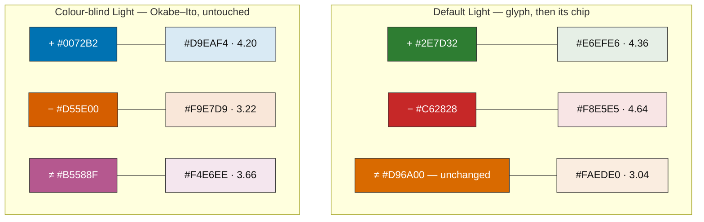
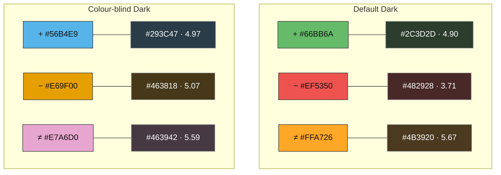

# 00005 — Change-marker chips

The change markers became `+` `−` `≠` semibold in `79d3ffd`, after measuring showed the ASCII pair
was too light to carry a row's kind where colour cannot: a hyphen laid down 5 pixels of ink against
a line number's 29. That fixed the glyph. This plan gives it a ground to sit on — a pale chip in
the kind's own colour, shaped to the *run* of same-kind rows rather than to the row, so a lone
changed line reads as a badge and a five-line block reads as one continuous band.

It also fixes the reason the problem stayed invisible for four plans: **nothing in the contrast
contract scores a marker against anything drawn behind it.**

## Goal

Each marker glyph sits on a chip of its kind's colour, rounded, centred under the glyph.
Consecutive rows of the same kind share one chip, so the gutter shows a block's extent as well as
each row's kind. The chip is the colour the row tint already is, so colour runs continuously from
the gutter into the line rather than stopping at a grey strip. Every marker clears its 3.0 contrast
floor with the chip behind it, no palette colour changes, and from now on the audit proves it.

## Non-goals

| Excluded | Note |
|---|---|
| Widening the gutter | The marker margin stays 16 px. Plan 00004 spent its effort reclaiming horizontal space; this plan gives none of it back |
| Changing the glyphs | `+` `−` `≠` semibold are settled and measured |
| Changing any marker or row-tint colour | An earlier draft darkened two of them. The pane-based chip made that unnecessary — see below |
| A chip on unchanged rows | The chip is a marker's ground. An unchanged row has no marker and gets none |
| Any Dark-variant tuning | Both Dark palettes clear the floor at their row tint's own alpha, worst 3.71 |

## What the measurements settled

The first design blended the chip into the gutter — the marker's colour at 18% over
`DiffView.GutterBackgroundBrush`. It darkens the ground *towards* the glyph, and it fails:

| Palette | inserted | deleted | modified |
|---|---|---|---|
| Default Light | 3.71 | 3.85 | **2.60** |
| Colour-blind Light | 3.69 | **2.84** | 3.23 |

**No alpha rescues that.** At 6% — far too faint to be worth drawing — Default Light modified is
still 2.98. A neutral grey chip is worse (2.54–2.82). The reason is that `#D96A00` sits 3.17
against a bare gutter and 3.49 against pure white, so its entire headroom is 0.49 and blending
*downward* spends more than it has.

**Compositing over the pane background instead moves the ground the other way.** The gutter is
`#F3F4F6`; the pane is `#FFFFFF`. A chip that is the marker over *white* is lighter than one that
is the marker over the gutter, so the glyph gains contrast rather than losing it — and it lands on
exactly the colour the row tint already is, which is the continuity that made the idea attractive
in the first place.

| Palette | chip alpha | inserted | deleted | modified |
|---|---|---|---|---|
| Default Light | 12% | 4.36 | 4.64 | **3.04** |
| Default Dark | 20% — its row tint | 4.90 | 3.71 | 5.67 |
| Colour-blind Light | 15% — its row tint | 4.20 | 3.22 | 3.66 |
| Colour-blind Dark | 20% — its row tint | 4.97 | 5.07 | 5.59 |

Worst case 3.04, and **every palette colour keeps its current value** — `#D96A00` included, and
Okabe–Ito's `#D55E00` untouched.

Three of the four chips are exactly their palette's row tint. Only Default Light steps down, 15% to
12%, because its modified marker has the least headroom of any marker in any palette; at 15% it is
2.94 and at 12% it is 3.04. That 3 % is the whole cost of keeping every colour as it is.

## Architecture

### The chip

Drawn by `ChangeMarkerMargin` before the glyphs, so the modified-since-load bar and the glyph both
land on top of it.

```
margin 16 px:   |  2  |        chip 12 px        |  2  |
                       glyph centred in the chip     ^ the modified-since-load bar's 2 px
```

Symmetric about the margin's centre — `Rect(2, top, Bounds.Width - 4, height)` — and the glyph is
placed at `(Bounds.Width - text.Width) / 2` rather than at `HorizontalPadding`. Centring the glyph
explicitly rather than trusting equal padding also protects the case the margin already measures
for: a host font whose fallback for one of the three characters does not share the family's advance
width. The first draft got this wrong — the chip ran `1 … width-3`, one pixel off centre, because
2 px at the inner edge is reserved for the modified-since-load bar.

The chip's inner edge stops exactly where that bar begins, so on an edited line inside a changed
block the two are adjacent, not overlapping — a pale kind-coloured field with a saturated 2 px
orange edge.

### Shaping the chip to the run

One rounded rectangle per run of consecutive same-kind rows, radius 3, inset 2 px at the run's ends
only. A one-row run is therefore a badge and a five-row run is one band; there is no second code
path for the two cases.

Two rules make it correct rather than merely contiguous:

- **A run breaks on padding.** If padding sits between two same-kind lines, those rows belong to the
  other side's lines and the band must not cover them — the same reasoning that corrected the
  modified-since-load bar in `aa241db`.
- **A run leaving the viewport gets no rounded end.** If the line above the first visible row shares
  the kind with no padding between, the rectangle extends a row past the top edge so the rounding
  falls outside the visible area. Otherwise a scrolled block appears to end exactly where the window
  does. Same at the bottom.

### The tokens, and the contract that will hold them

Three new brushes per palette per variant, **opaque**, each the kind's marker colour composited
over that variant's pane background at the alpha in the table above:

| Token | Default Light | Default Dark | Colour-blind Light | Colour-blind Dark |
|---|---|---|---|---|
| `DiffView.MarkerChipInsertedBrush` | `#E6EFE6` | `#2C3D2D` | `#D9EAF4` | `#293C47` |
| `DiffView.MarkerChipDeletedBrush` | `#F8E5E5` | `#482928` | `#F9E7D9` | `#463818` |
| `DiffView.MarkerChipModifiedBrush` | `#FAEDE0` | `#4B3920` | `#F4E6EE` | `#463942` |

Opaque rather than translucent, for two reasons. The audit can score an opaque token directly
against the glyph, with no `over` key to get wrong. And the colour is deliberately *not* a blend
with the surface it is painted on — it is computed over the pane, drawn on the gutter — which a
translucent brush cannot express.

`DiffBrush.ChipInserted` / `ChipDeleted` / `ChipModified` reach them, and three new pairs go into
`contrast-pairs.json`: each marker against its own chip, floor 3.0. The drift test then enforces
for every future change what this plan had to measure by hand.

**This is the part that generalises.** The contract scores markers on the plain gutter and on the
host page, and nothing else; a decorator drawn *behind* a marker was outside what it could see. Any
future ground under a glyph inherits the guard now.

### Swatches





## Phases

| Phase | Size | Content |
|---|---|---|
| **1 — The tokens and the contract** | M | Twelve chip brushes across both palettes and both variants; the `DiffBrush` entries and fallbacks; three new pairs in `contrast-pairs.json`; `theme-audit compat` then `report` regenerated. Nothing is drawn yet, so no frame moves — the phase's whole output is that the audit now scores a floor nothing had scored |
| **2 — The chip** | M | Run-shaping with its two edge rules, the symmetric geometry, the glyph centred in the chip, the ordering against the modified-since-load bar; the headless tests |
| **3 — Evidence** | S | Snapshots of a multi-row run, a lone changed line, and a run crossing the viewport edge, in both variants; the mutations; `DECISIONS.md`, `PROGRESS.md` and the changelog |

## Testing

Per the house rule, every new test is proven able to fail before it is committed.

| Test | Asserts |
|---|---|
| One chip per run | Five consecutive deleted rows produce one chip, not five; its extent is the run's first row top to its last row bottom |
| A lone changed row is a badge | One modified row produces one chip of a single row's height, same corner radius |
| A run breaks on padding | Same-kind lines separated by padding produce two chips, and neither covers the padding rows between them |
| A run leaving the viewport is not rounded there | Scrolled so a block starts above the top edge, the chip's top is above the viewport and its visible top edge is square |
| The glyph is centred in its chip | For every kind, the glyph's centre equals the chip's centre within half a pixel — the geometry bug this plan starts from |
| The margin does not grow | Measured width is 16 px with chips on and off, as plan 00004 asserted for the copy arrow |
| The chip does not reach the bar | The chip's right edge is at `Bounds.Width - ModifiedBarWidth`, and an edited line inside a block paints both |
| Contrast | `theme-audit report` finds 0 low-contrast findings with the three new pairs present — the guard that would have caught this four plans ago |
| Every marker still scans | `MarkerGlyphTests.Every_marker_is_heavy_enough_to_scan` passes with the chip behind the glyph, ink measured against the chip rather than the gutter |

## Risks

| Risk | Assessment |
|---|---|
| **The baselines will not fail on their own.** A chip is glyph-scale and the comparer tolerates 0.5 % | Certain, not possible. The procedure from `79d3ffd` applies: zero `ChannelTolerance` and `MaxDifferingFraction` for one run, regenerate exactly what that flags, restore the comparer. Expect ~30 baselines |
| 3.04 is thin | It is, and it is the price of keeping `#D96A00`, which is the colour the palette wants. The new contract pair is what makes it safe: any future change that erodes it fails the audit instead of shipping. Darkening the token to `#BF5D00` remains available and buys 3.20 — it was rejected on looks, not on numbers |
| Default Light's chip is 12 % where its row tint is 15 % | A three-point difference across the gutter/pane boundary, where the surfaces already differ by more than that. Visible only if looked for; the phase 3 frames are how it gets judged |
| Run-shaping arithmetic at the viewport edges | The sharpest code risk, and the same family as the padding arithmetic plan 00004 got wrong once. A dedicated scrolled test, not just an unscrolled one |
| Twelve new tokens is a lot of palette surface | They are derived values, not choices — each is its marker over its pane background at a stated alpha, and the plan records the arithmetic. A future palette change means recomputing them, which the audit will demand |

## Conventions

Conventional Commits, dense bodies, no AI attribution trailer. Every user-visible string through
`DiffViewStrings`, every log line through `DiffViewLog`. The theme audit regenerates after any
change under `src/DiffView.Avalonia/Themes`. New tests are proven able to fail before they are
committed, and a snapshot is never the only guard for anything smaller than a row.
